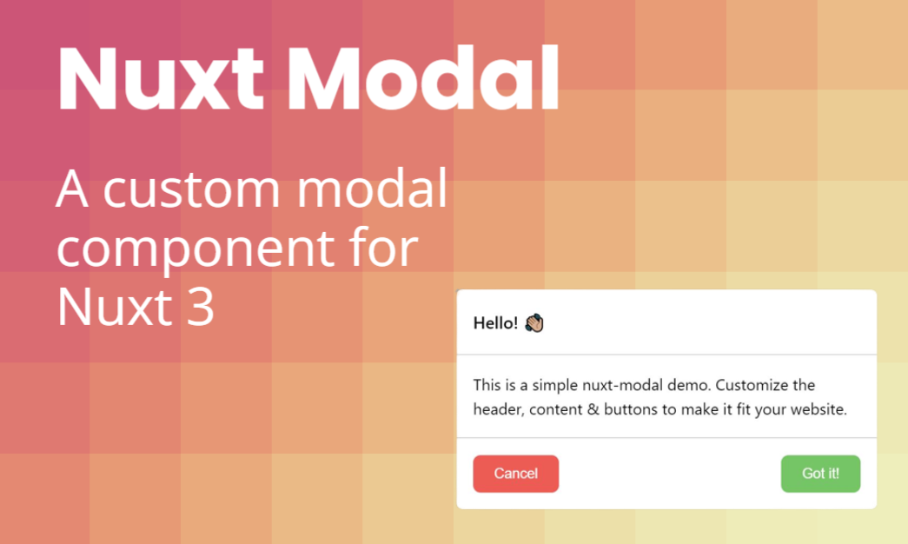

# Nuxt 3 Modal

[![npm version][npm-version-src]][npm-version-href]
[![Nuxt][nuxt-src]][nuxt-href]

> Custom modal component for Nuxt 3.

- [Open the playground on StackBlitz](https://stackblitz.com/github/timb-103/nuxt-modal/tree/master?file=.playground%2Fapp.vue).

## Features

- 🔧 Fully customizable (colors, functions, slots)
- 🤳🏻 Slides up on mobile
- ✨ Nice fade in/out
- ⚡ Setup in seconds
- ✅ Works for all use cases

## Install

Install the layer:

```sh
npm i -D nuxt-modal
```

Add the layer in the `extends` array in `nuxt.config.ts`:

```js
export default defineNuxtConfig({
  extends: ['nuxt-modal'],
})
```

## Usage

In your script, declare the modal, using the `useModal` composable:

```js
const modal = useModal()
```

Then, add a modal:

```vue
<template>
  <NuxtModal
    v-if="modal.visible.value === 'basic-modal'"
    @close="modal.close()"
    @proceed="modal.close()"
  >
    <template v-slot:header>Hello! 👋🏼</template>
    <template v-slot:content>
      <p>This is a basic nuxt-modal, that can bo opened with modal.open('basic-modal')</p>
    </template>
    <template v-slot:buttons>
      <button @click="modal.close()">Cancel</button>
      <button @click="doSomethingElse()">Got it!</button>
    </template>
  </NuxtModal>
</template>
```

Alternatively you can add the modal into a component:

```vue
<!-- components/modals/ModalComponent.vue -->
<template>
  <ModalComponent
    v-if="modal.visible.value === 'component'"
    @close="modal.close()"
    @proceed="modal.close()"
  />
</template>
```

Then, to open your modal:

```vue
<button @click="modal.open('modal-name')">Open Modal</button>
```

or, in the script section

```js
function openModal() {
  modal.open('modal-name')
}
```

## Components

**`NuxtModal`**

The main component used to display modals is `NuxtModal`. Here's the full default configuration:

```js
<template>
  <NuxtModal
    :header="true"
    :buttons="true"
    :borders="true"
    @close="modal.close()"
    @proceed="modal.close()"
  />
</template>
```

## Composables

**`useModal`**

The useModal composable can be used to open & close the modal, as well as passing data to the modal if you need. It exposes the following:

- `open('modal-name')` // open a modal
- `close()` // close the modal
- `visible` // the currently visible modal
- `data` // custom data passed to the modal

## Slots

**`header`**

Shown at the top of the modal. Best to just display a title.

---

**`content`**

The main content of the modal.

---

**`buttons`**

The buttons to show in the bottom of the modal. If you don't add any, we'll show a cancel & proceed button as the fallback.

**Props**

`header`

show/hide the modal header

---

`buttons`

show/hide the modal buttons

---

`borders`

show/hide the header & button borders

---

**Events**

`close`

Fired when the users clicks the cancel button, or the modal background. You just want to use the composable function `modal.close()` in here.

`proceed`

Fired when the user accepts the modal. You can put any function in here to do something based on what the modal is for.

<!-- Badges -->

[npm-version-src]: https://img.shields.io/npm/v/nuxt-modal/latest.svg
[npm-version-href]: https://npmjs.com/package/nuxt-modal
[npm-downloads-src]: https://img.shields.io/npm/dt/nuxt-modal.svg
[npm-downloads-href]: https://npmjs.com/package/nuxt-modal
[nuxt-src]: https://img.shields.io/badge/Nuxt-18181B?logo=nuxt.js
[nuxt-href]: https://nuxt.com
